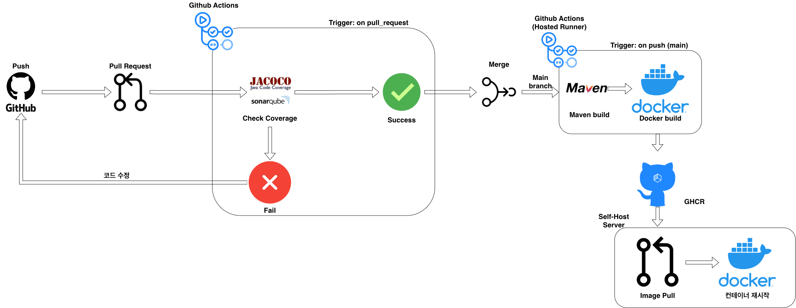

# 4iren infra

이 레포지토리는 **4iren 프로젝트**의 전체 인프라 구성, CI/CD 배포 파이프라인을 모아둔 레파지토리 입니다.

> **자세한 설명과 가이드라인은 [Wiki](https://github.com/nhnacademy-aiot3-4iren/4iren-infra/wiki)를 참고해 주세요!**
> 본 README는 전체적인 구조와 빠른 실행 방법만 요약해서 제공합니다.

---

## 사용 기술 (Tech Stack)

### Infra & DevOps
- Docker / Docker Compose
- Nginx
- GitHub Actions
- Cloudflare

### Monitoring & Logging
- Prometheus
- Grafana
- Filebeat
- Elasticsearch

### MSA (Microservices Architecture)
- Spring Cloud Netflix Eureka
- Spring Cloud Gateway
- Spring Cloud Config

### Code Quality
- SonarQube
- JaCoCo

---

## 시스템 및 CI/CD 아키텍처

개발자의 코드 푸시(Push)부터 운영 서버에 무중단으로 배포되기까지의 전체 CI/CD 자동화 흐름입니다. PR 단계에서 SonarQube와 JaCoCo를 통해 코드 품질을 엄격하게 검증하며, 메인 브랜치 병합 시 헬스체크 기반의 롤링 업데이트로 서비스 중단 없이 안전하게 배포됩니다. 파이프라인의 모든 성공/실패 결과는 Telegram 봇을 통해 즉각적으로 팀에 공유됩니다.

<div align="center">
  <br>
    
</div>

---

## 디렉토리 구조 (Directory Structure)

레포지토리는 크게 세 가지 역할을 하는 폴더로 나뉘어 있습니다.

- **`/app`** : 실제 서비스(Spring Boot 기반 마이크로서비스)들의 실행을 담당합니다.
  - Gateway, Eureka, Config 서버 및 각종 비즈니스 로직(Auth, Account, Core 등) 컨테이너 실행 설정이 포함되어 있습니다.
- **`/infra`** : 서비스 운영을 뒷받침하는 기반 인프라를 담당합니다.
  - **Nginx**: 리버스 프록시 및 로드밸런싱 (무중단 배포 라우팅 처리)
  - **Monitoring**: Prometheus, Grafana, Filebeat 등 로깅 및 모니터링 구축
- **`/deploy`** : CI/CD 파이프라인 및 배포 스크립트 템플릿입니다.
  - `deploy.yml`: Nginx와 Healthcheck를 활용한 **Zero-Downtime(무중단) 롤링 배포** GitHub Actions 템플릿
  - `pr-check.yml`: PR 생성 시 SonarQube 정적 분석 및 JaCoCo 커버리지 리포팅 템플릿

---

## 빠른 시작 (Quick Start)

로컬 혹은 개발 서버에서 전체 인프라를 구동하는 방법입니다.

### 1. 환경 변수 설정
최상위 경로에 `.env` 파일을 생성하고 필요한 환경 변수를 주입합니다.
(비밀번호, 토큰 등 보안이 필요한 값들은 커밋되지 않도록 주의하세요.)

### 2. 네트워크 생성
모든 컨테이너가 통신할 수 있도록 외부 네트워크를 생성합니다.
```bash
docker network create team4-aiot-network
```

### 3. 기반 인프라 실행
모니터링, Nginx 등의 인프라를 먼저 구동합니다.
```bash
cd infra
docker compose -f docker-compose-infra.yml up -d
```

### 4. 백엔드 앱 실행
MSA 컨테이너들을 실행합니다.
```bash
cd app
docker compose up -d
```

---

## 문서 및 자료 (Docs & Resources)

프로젝트와 관련된 상세한 문서, 아키텍처 설계도, 회의록 등은 아래의 링크에서 확인하실 수 있습니다.

- **[GitHub Wiki](https://github.com/nhnacademy-aiot3-4iren/4iren-infra/wiki)**: CI/CD 연동 방법, 각 서버별 무중단 롤링 배포 전략, Nginx 설정 등 기술적인 세부 가이드
- **[Notion 개인 페이지](https://app.notion.com/p/39ef42d465328052969dedada9ae7849?source=copy_link)**: 인프라 관련 사용 기술 사용 이유 & 장단점 정리

개발 및 운영 시 반드시 위 문서들을 먼저 숙지해 주세요.
